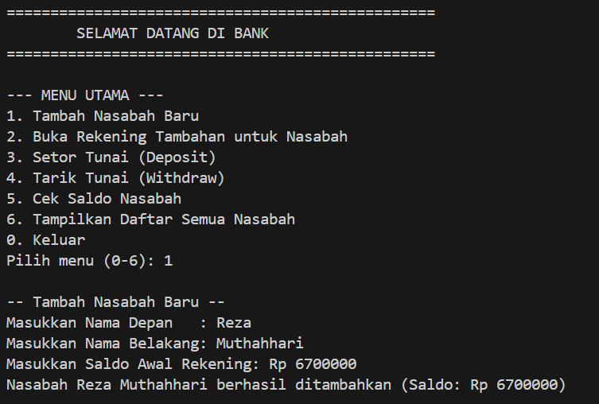
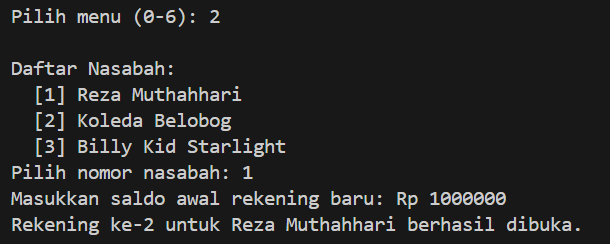
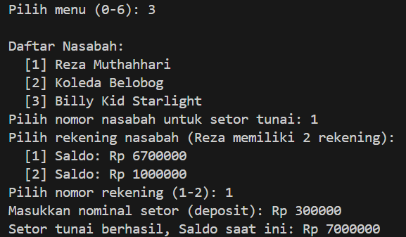
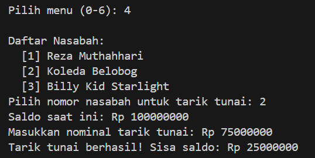
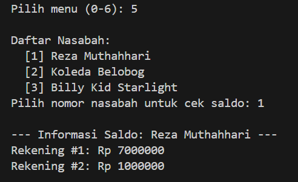
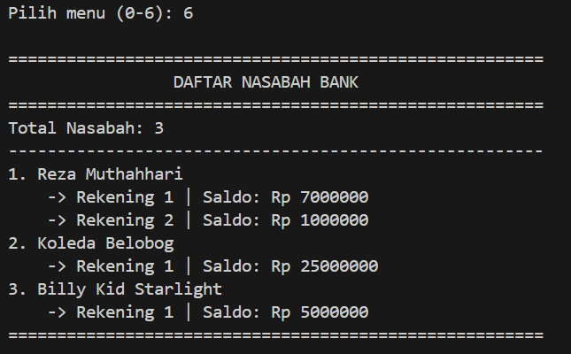

# Java OOP Assignment: Banking System (Array & ArrayList)

---

## 1. Project Overview
This project is a simple banking simulation system built using Object-Oriented Programming (OOP) in Java. It demonstrates class associations (**Bank** $\rightarrow$ **Customer** $\rightarrow$ **Account**) and showcases two core data collection structures:
* **Fixed-size Array (`[]`)**: Implemented in the `Bank` class to manage customers with a predefined capacity.
* **Dynamic `ArrayList`**: Implemented in the `Customer` class to manage multiple accounts per customer dynamically.

---

## 2. Classes and Methods Overview

### a. `Account.java`
Manages account balance and financial transactions.
* **Attributes:**
  * `protected double balance`: Stores the current balance of the account.
* **Methods:**
  * `Account(double bal)`: Constructor to initialize the account with an initial balance.
  * `double getBalance()`: Returns the current balance.
  * `boolean deposit(double amount)`: Deposits funds if the amount is $> 0$ (returns `true` if successful, `false` otherwise).
  * `boolean withdraw(double amount)`: Deducts funds if the balance is sufficient (returns `true` if successful, `false` otherwise).

---

### b. `Customer.java`
Represents an individual bank customer and manages their accounts using an **`ArrayList`**.
* **Attributes:**
  * `private String firstName`: Customer's first name.
  * `private String lastName`: Customer's last name.
  * `private ArrayList<Account> accounts`: Dynamic collection holding the customer's accounts.
* **Methods:**
  * `Customer(String f, String l)`: Constructor initializing the customer's name and creating the `ArrayList`.
  * `String getFirstName()`: Retrieves the first name.
  * `String getLastName()`: Retrieves the last name.
  * `void setAccount(Account acct)`: Adds a new account to the customer's list using `.add()`.
  * `Account getAccount(int account_index)`: Retrieves an account at a specific index using `.get()`.
  * `Account getAccount()`: Convenience method to retrieve the customer's primary account.
  * `int getNumOfAccounts()`: Returns the number of accounts using `.size()`.

---

### c. `Bank.java`
Represents the bank organization and manages all registered customers using a **standard fixed-size Array (`[]`)**.
* **Attributes:**
  * `private Customer[] customers`: Array of `Customer` objects (capacity of 10).
  * `private int numberOfCustomers`: Counter tracking the current number of registered customers.
* **Methods:**
  * `Bank()`: Constructor that allocates memory for an array of 10 customers and initializes the counter to 0.
  * `void addCustomer(String f, String l)`: Constructs a new `Customer`, stores it in the array, and increments `numberOfCustomers`.
  * `int getNumOfCustomers()`: Returns the total count of registered customers.
  * `Customer getCustomer(int index)`: Retrieves a `Customer` object by index.

---

### d. `BankDemo.java`
The main driver class providing an interactive Command-Line Interface (CLI) menu to:
* Register new customers with initial balances.
* Open additional accounts for existing customers.
* Perform deposit and withdrawal operations with balance validation.
* Check customer account balances.
* Display a complete report of all customers and their accounts.

---

## 3. Output Screenshots

### 1. Main Menu & Add New Customer

### 2. Add Another Account

### 3. Deposit Operation

### 4. Withdraw Operation

### 5. Check Balance

### 6. List All Customers

